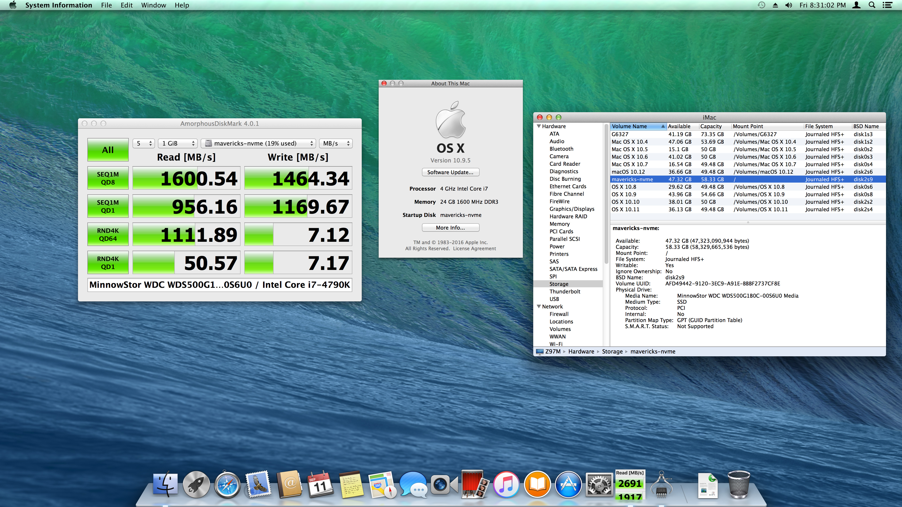
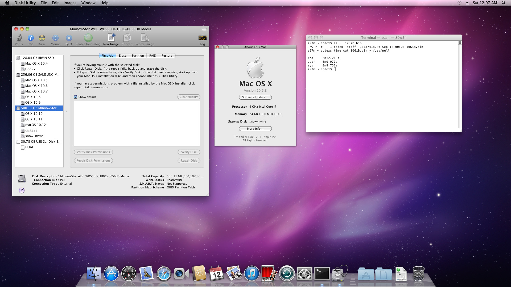

# NVMe Driver for Legacy Mac OS X

<p align="center">
  
  
</p>

This project makes the NVMe driver (NVMeGeneric) usable from Mac OS X 10.6 Snow
Leopard through OS X 10.9 Mavericks. It provides 2 builds:

| Build | Supported systems | OpenCore kernel range |
| --- | --- | --- |
| NVMeGeneric-Snow | 10.6–10.8 | 10.0.0–12.99.99 |
| NVMeGeneric-Mavericks | 10.9 | 13.0.0–13.99.99 |

The Snow build is 64-bit only. Snow Leopard must be running the x86_64 kernel.
Runtime testing was performed only on the final updates: 10.6.8, 10.7.5,
10.8.5, and 10.9.5.

This project does not add NVMe support to firmware. To boot from NVMe, the
firmware or boot loader must expose the NVMe controller and target volume before
Mac OS X starts.

[日本語版](README_ja.md)

## Other OS versions

This project targets 10.6–10.9. For later releases, use the existing solutions:

- OS X 10.10 Yosemite: use the original NVMeGeneric driver from the
  [archived MacVidCards page](https://web.archive.org/web/20160614135522/http://www.macvidcards.com/nvme-driver1.html).
- OS X 10.11 El Capitan and macOS 10.12 Sierra: use
  [RehabMan's patch-nvme](https://github.com/RehabMan/patch-nvme) to build the
  appropriate HackrNVMeFamily for the exact OS build.

## Installation

Download the files from
[Releases](https://github.com/b00t0x/nvme-legacy-osx/releases).

### OpenCore injection for Hackintosh systems

The zip archive is intended for Hackintosh systems. Extract
`NVMeGeneric-Kexts-YYYYMMDD.zip`, copy the applicable kext to
`EFI/OC/Kexts`, and add it under `Kernel/Add` in `config.plist`.

Suggested bounds:

```text
NVMeGeneric-Snow.kext:       MinKernel 10.0.0, MaxKernel 12.99.99
NVMeGeneric-Mavericks.kext:  MinKernel 13.0.0, MaxKernel 13.99.99
```

### Package installation for real Macs

Use `NVMeGeneric-Snow-YYYYMMDD.pkg` for 10.6–10.8 or
`NVMeGeneric-Mavericks-YYYYMMDD.pkg` for 10.9.

## Tested scope

Development and testing were performed on a Hackintosh. The promoted builds
were tested on an Intel Z97 system with a WD Blue SN500 PCIe 3.0 x2 NVMe SSD.
Testing covered NVMe recognition, HFS+ read/write, NVMe root boot, shutdown, and
restart on all supported major versions.

Operation on a real Mac has not been tested. A Mac model whose EFI firmware has
been updated with NVMe boot support may be able to boot these systems from NVMe,
but this remains unverified. Compatibility with every NVMe controller or Mac is
not established.

## Data safety

The modifications were created using an LLM, and long-term stability has not
been established. For a system used regularly, keep a current Time Machine
backup on a separate SATA drive. Use this software at your own risk; the project
authors are not responsible for data loss or other damage resulting from its
use.

## Technical notes and building

- [Mavericks changes](docs/CHANGES_MAVERICKS.md)
- [Snow Leopard through Mountain Lion changes](docs/CHANGES_SNOW.md)
- [Build and release process](docs/BUILD.md)

[The tools](./tools/) accept only the exact original NVMeGeneric 1.1 input
recorded in
[`manifests/inputs.sha256`](manifests/inputs.sha256) and reproduce the promoted
executables recorded in [`manifests/outputs.sha256`](manifests/outputs.sha256).

## Licensing and attribution

[The license](./LICENSE) covers only this project's original scripts and
documentation. NVMeGeneric remains third-party software and retains its
original copyright and embedded notice. See
[`THIRD_PARTY_NOTICES.md`](THIRD_PARTY_NOTICES.md) before using or distributing
generated binaries.
